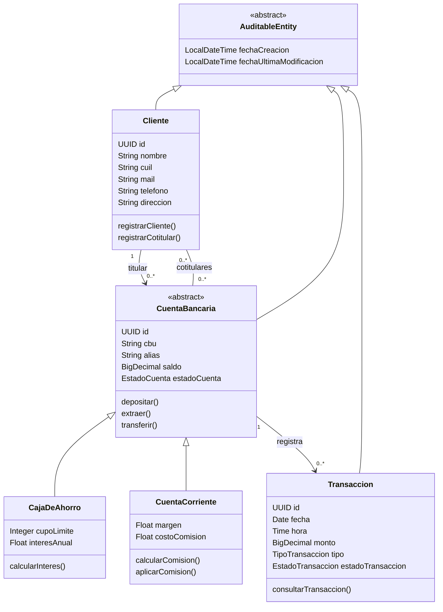

# 🏦 Sistema Bancario


Backend bancario con **Spring Boot** y **MySQL** que gestiona clientes, cuentas (caja de ahorro y cuenta corriente) y transacciones. Realizado en el marco de la cursada de **Desarrollo y Arquitecturas Avanzadas de Software** (Universidad Nacional de Jujuy).

**Integrantes:** Mauricio Fernando Benitez · Luis Carlos Manuel Mamaní

---

## 🛠️ Tecnologías

| Tecnología | Uso |
|------------|-----|
| Java 25 | Lenguaje |
| Spring Boot 4.1.1 | Framework base |
| Spring Data JPA / Hibernate | Persistencia |
| MySQL 8 (Docker) | Base de datos |
| Maven (wrapper) | Build |
| Lombok | Reducción de código repetitivo |

## 🧱 Arquitectura

Arquitectura en capas, con interfaces que desacoplan la lógica de su implementación.

```text
sistemabancario/
├── config/          # Auditoría JPA
├── model/           # Entidades JPA y enumeraciones
├── repository/      # Repositorios (JpaRepository)
├── service/         # Interfaces de negocio
└── service/impl/    # Implementaciones con validaciones y transacciones
```

## 🗄️ Modelo de dominio



## 🚀 Puesta en marcha

**Requisitos:** JDK 25 y Docker (Maven no hace falta, se usa el wrapper).

**1. Levantar MySQL** (crea el esquema y el usuario):

```bash
docker run --name mysql-8.4.0 -p 3306:3306 -d \
  -e MYSQL_ROOT_PASSWORD=<root> \
  -e MYSQL_DATABASE=sistema_bancario \
  -e MYSQL_USER=admin_banco \
  -e MYSQL_PASSWORD=<contraseña> \
  mysql:8.4.0
```

**2. Definir las variables de entorno** que lee la aplicación:

| Variable | Valor |
|----------|-------|
| `DB_URL` | `jdbc:mysql://localhost:3306/sistema_bancario?serverTimezone=UTC` |
| `DB_USERNAME` | `admin_banco` |
| `DB_PASSWORD` | la definida en el paso 1 |

**3. Ejecutar:**

```bash
./mvnw spring-boot:run
```

> [!TIP]
> Las tablas se crean solas al iniciar (`ddl-auto: update`).

## 🧪 Pruebas

```bash
./mvnw test
```

> [!WARNING]
> Las pruebas usan una base MySQL real y leen `src/test/resources/application.yaml`, que está en el `.gitignore`. Cada integrante debe crearlo localmente con su propia conexión.

## 📄 Licencia

Licencia MIT. Ver el archivo [LICENSE](LICENSE).